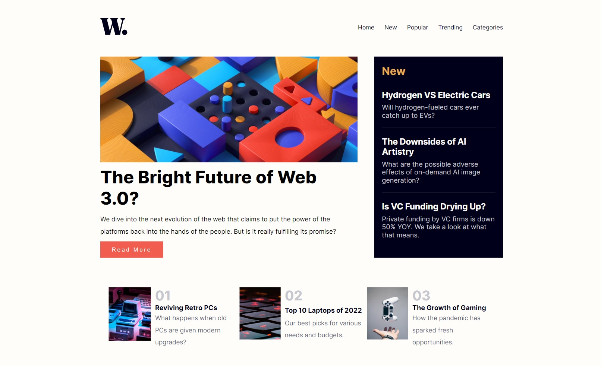
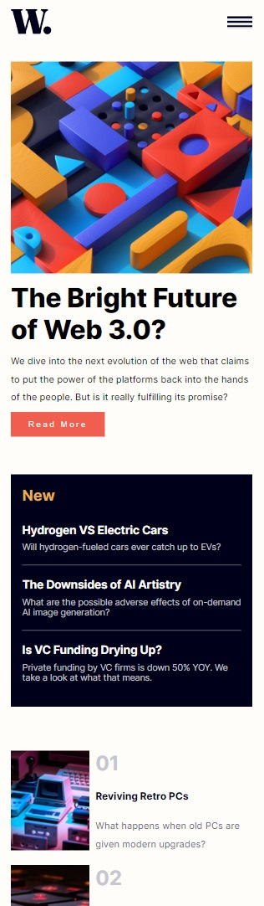
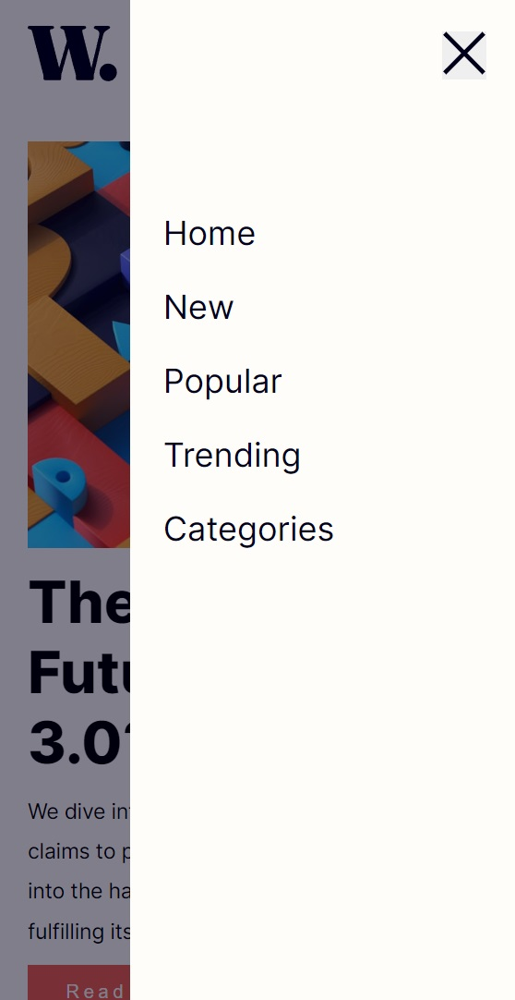

# Frontend Mentor - News homepage solution

This is a solution to the [News homepage challenge on Frontend Mentor](https://www.frontendmentor.io/challenges/news-homepage-H6SWTa1MFl). Frontend Mentor challenges help you improve your coding skills by building realistic projects. 

## Table of contents

- [Frontend Mentor - News homepage solution](#frontend-mentor---news-homepage-solution)
  - [Table of contents](#table-of-contents)
  - [Overview](#overview)
    - [The challenge](#the-challenge)
    - [Screenshot](#screenshot)
      - [Desktop View](#desktop-view)
      - [Mobile View](#mobile-view)
      - [Mobile View with Menu Opened](#mobile-view-with-menu-opened)
    - [Links](#links)
  - [My process](#my-process)
    - [Built with](#built-with)

## Overview

### The challenge

Users should be able to:

- View the optimal layout for the interface depending on their device's screen size
- See hover and focus states for all interactive elements on the page

### Screenshot

#### Desktop View

#### Mobile View

#### Mobile View with Menu Opened

### Links

- Live Site URL: [GitHub Page](https://soonyu97.github.io/Frontend-Mentor-News-Homepage)

## My process

### Built with

- Semantic HTML5 markup
- CSS custom properties
- Flexbox
- CSS Grid
- Mobile-first workflow
